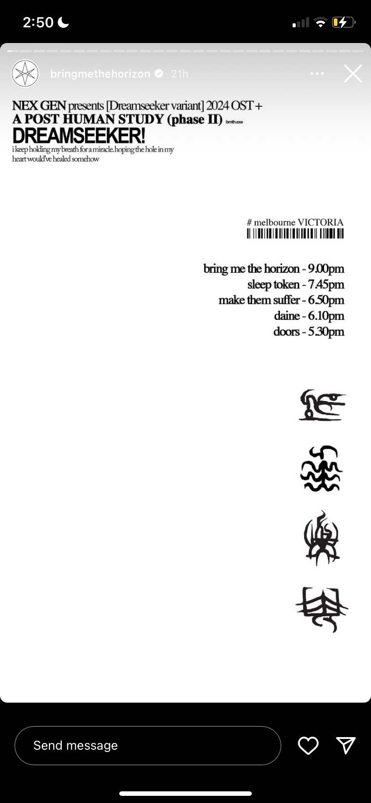
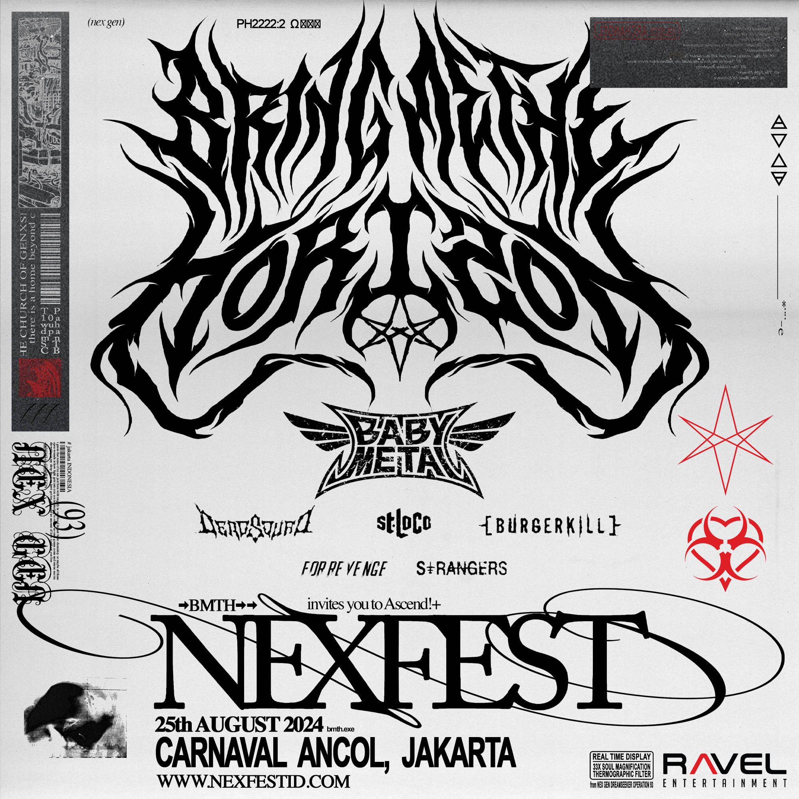
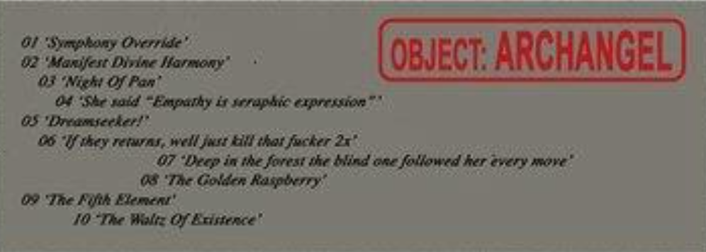

# Walkthrough Part 2: FOR SOF

**[← previous](walkthrough)**

This folder of files is where most of the ARG takes place.
First, we need to gain access to it!

Passwords will be marked for spoilers, but this article will contain some 
images and links related to the documents.

***

## Quick access

**[Previous part of the walkthrough](walkthrough)**

Jump to section:

- [Folder password](#the-folder)
- [msgforsof.aiff](#msgforsofaiff)
- [THEINSIGHTS.DOC](#theinsightsdoc)
- [The insight files](#insight-files)
- [CAPSLOCK.DOC](#capslockdoc)
- [StrassmanCONFIDENTIALPRT007.CODEC](#strassmanconfidentialprt007codec)
- [DREADITScreenshot 2051.1.5.59.43.vis](#dreaditscreenshot-2051155943vis)
- [YOUTOPIA_selenes_map.vis](#youtopia_selenes_mapvis)
- [R8/fulfilment_source[m0n0].doc](#r8fulfilment_sourcem0n0doc)
- [Selene_Personal_Journal_2037.02.doc](#selene_personal_journal_203702doc)
- [Lauren_D8_Log_203701.docx](#lauren_d8_log_203701docx)
- [Scott_Personal_Journal_VSPR-37.doc](#scott_personal_journal_vspr-37doc)
- [Operation_Trinity_Analysis.xslx](#operation_trinity_analysisxslx)
- [ISSUE-51-fromhelltoshell.pdf 1](#issue-51-fromhelltoshellpdf-1)
- [Jan15_2031_declassified_PROJECT D.U.S.T. 2](#jan15_2031_declassified_project-dust-2)
- [SCISTUDYSCAN1999wrist.SCN](#scistudyscan1999wristscn)
- [Sky_&_The_Starjammers.png](#sky__the_starjammerspng)
- [Nex Gen leak ‘UNBELEEVABLE’.doc](#nex-gen-leak-unbeleevabledoc)

You do not have to open the files in this order.
To navigate this page you can jump back up with [↑ Quick access](#quick-access) links.

***

## The folder

The folder can be found on the left side of the webpage. It's orange with an interesting
symbol on it.
When we click the folder, we find out that it's locked!

Hint 1

The password can be found by taking a good look at the ARG website itself.

Hint 2

Take a good look at the system time; you'll notice that there is something off about it.

Solution

The password for the folder is "past". We don't have an official explanation for this, but it is assumed
to be the password due to the time discrepancies on the webpage.

You can find more explanations about the webpage by reading some related articles.

- [Webpage](../webpage)
- [Website songs](../music/website-songs)
- [Website browser](../webbrowser)

[↑ Quick access](#quick-access)

***

### msgforsof.aiff

The first file is an [audio log](../files/msgforsof) that does not need a password.

- [msgforsof.aiff](../files/msgforsof)
- [Sof](../characters/sof)
- [Selene](../characters/selene)

[↑ Quick access](#quick-access)

***

## THEINSIGHTS.DOC

The second file is a document that also does not require a password.
Before doing some more research, we recommend opening the next set of files first.

- [THEINSIGHTS.doc](../lore/insights)

[↑ Quick access](#quick-access)

***

## Insight files

Files 3–6 are a set of four, as is visible from their filenames. Their password screens
contain hints in the form of symbols.

Files hint 1

As you can gather from the file names, the passwords are related to the four insights
we just read about.
These were actually revealed in multiple social media posts, so take a look on Instagram or X.

Files hint 2

There is more hidden in the audio on NEx Gen. Have a look at the songs again!

Solution first file

The first insight is 'connection'.
The spectrogram for Top 10 staTues tHat CriEd bloOd
contains this password, but we can also see it in several social media posts.

Solution second file

The second insight is 'empathy' and can be found in the spectrogram
in n/A. It can also be seen in social media posts occasionally.

Solution third file

The third insight is 'purpose' and can be found in the spectrogram
in [ost] puss-e.

Solution fourth file

The fourth insight is 'vision' and can be found in the spectrogram
in DIg It.

These files will tell us more about the lore, but we are only just at the start.

Insights:

- [The Insights](../lore/insights)
- [1. Connection](../lore/insight1-connection)
- [2. Empathy](../lore/insight2-empathy)
- [3. Purpose](../lore/insight3-purpose)
- [4. Vision](../lore/insight4-vision)

Songs:

- [Top 10 staTues tHat CriEd bloOd](../music/song-top10)
- [n/A](../music/song-na)
- [[ost] puss-e](../music/song-pusse)
- [DIg It](../music/song-digit)

Characters:

- [Raphael](../characters/raphael)
- [Pan](../characters/pan)
- [Gabriel](../characters/gabriel)
- [Miseria](../characters/miseria)
- [Michael](../characters/michael)
- [Vanth](../characters/vanth)
- [Uriel](../characters/uriel)

[↑ Quick access](#quick-access)

***

## CAPSLOCK.DOC

This file is a special case, as it was uncovered before it was supposed to be.
Also see the [article on this file](../files/capslock_doc).
We recommend reading this file at the end of your walkthrough and not following the instructions
in it.

Hint 1

You are going to have a closer look at the album track list.

Hint 2

Take the capital letters from the track list and find an anagram that matches
the phrase on the password screen.

Solution

By decoding the capital letters from the track list, we get
'DEKODE THE MATRIX TO ATTAIN YOUR CONCEALED ORIGINS'.

Let's move on with the file actually intended to be next.

- [CAPSLOCK.DOC](../files/capslock_doc)

[⬆️ Quick access](#quick-access)

***

## StrassmanCONFIDENTIALPRT007.CODEC

This time we are working on a video file.

Hint 1

Take a look at the password screen and listen to the album closely.
Any dialogue can be important.

Hint 2

You are looking for a name and will need to reverse some audio to find it. Good luck!

Solution

The password is the name of the character we see on the login screen. We
get the name 'Karl Strassman' from a bulleT w/my namE On.

Learn more about Strassman in the related articles.

- [StrassmanCONFIDENTIALPRT007.CODEC](../files/strassmancodec)
- [Nex Gen Corporation](../lore/nex-gen-corporation)
- [Karl Strassman](../characters/strassman)
- [E.V.E](../characters/eve)
- [a bulleT w/my namE On](../music/song-abwmno)

[↑ Quick access](#quick-access)

***

## DREADITScreenshot 2051.1.5.59.43.vis

Hint 1

The password can be found on the ARG website itself.

Hint 2

Look in the browser.

Solution

The password is '1d1b2c2a' and can be found in the Spyder browser URL.

This unlocks a Dreadit post with some comments on it.

- [DREADITScreenshot 2051.1.5.59.43.vis](../files/dreadit)
- [Nex Gen Corporation](../lore/nex-gen-corporation)
- [Selene](../characters)
- [Neosages](../lore/mantra) (Spoiler-heavy for upcoming files)

[↑ Quick access](#quick-access)

***

## YOUTOPIA_selenes_map.vis

This time we are promised a map of Youtopia. Let's get to it.

Hint 1

The password can be found on the ARG website itself

Hint 2

Make sure to catch all of M8's dialogue.

Solution

The password is M8's middle name: "clive". We hear this when prompting M8 through 
the sticky note.

We've now got the map, which will tell us a little more about Youtopia.

- [YOUTOPIA_selenes_map.vis](../files/selenes_map)
- [Youtopia](../lore/youtopia)
- [The Insights](../lore/insights)

Related characters:

- [Selene](../characters/selene)
- [Raphael](../characters/raphael)
- [Pan](../characters/pan)
- [Gabriel](../characters/gabriel)
- [Miseria](../characters/miseria)
- [Michael](../characters/michael)
- [Vanth](../characters/vanth)
- [Uriel](../characters/uriel)

[↑ Quick access](#quick-access)

***

## R8/fulfilment_source[m0n0].doc

Hint 1

The "mono" in the title is referring to a mono channel.

Hint 2

Listen to Top 10 staTues tHat CriEd bloOd.

Solution

True fulfillment comes from "within", as we learn in the mono audio of Top 10 staTues tHat CriEd bloOd.

This gives us a spec sheet for some technology.

Related articles

- [R8](../files/r8)
- [M8](../m8)
- [D8](../files/lauren_d8_log)

[↑ Quick access](#quick-access)

***

## Selene_Personal_Journal_2037.02.doc

Hint 1

Look at the information presented about Selene on the webpage carefully.

Hint 2

You are looking for a 4-digit number.

Solution

The password is Selene's user number in the M8 system, "0003".

You can learn more in the related articles, but we recommend unlocking [Scott's diary](#scott_personal_journal_vspr-37doc) 
first.

- [Selene_Personal_Journal_2037.02.doc](../files/selene_personal_journal)
- [Selene](../characters/selene)

[↑ Quick access](#quick-access)

***

## Lauren_D8_Log_203701.docx

This is an interesting document that tells us more about the origins of a key character.

Hint 1

Look at the information presented on the webpage carefully.

Hint 2

You are looking for a 4-digit number.

Solution

The password is Ren's user number in the M8 system, "0014". 
In this log we find out that his full name is Ikaro Lauren.

More details on this character and document can be found in the related articles.

- [Lauren_D8_Log_203701.docx](../files/lauren_d8_log)
- [Ren](../characters/ren)

[↑ Quick access](#quick-access)

***

## Scott_Personal_Journal_VSPR-37.doc

This is the personal journal of Scott, who we will learn more about in his personal journal.

Hint 1

Look at the information presented on the webpage carefully.

Hint 2

You are looking for a 4-digit number.

Solution

The password is Syko's user number in the [M8 system](../webpage), 0005.
In this log we find out that Syko was still called Scott at 16 years old.

You can read more about Scott in the related articles. This file is strongly tied to 
[Selene's diary](#selene_personal_journal_203702doc).

- [Selene_Personal_Journal_2037.02.doc](../files/selene_personal_journal)
- [Selene](../characters/selene)
- [Scott_Personal_Journal_VSPR-37.doc](../files/scott_personal_journal)
- [Syko](../characters/syko)
- [Dear Diary,](../music/song-dear-diary)

[↑ Quick access](#quick-access)

***

## Operation_Trinity_Analysis.xslx

Hint 1

The password can be found on Instagram.

Hint 2

Look for a post on BMTH's instagram where one post contains 
four pieces of text can be found that are not lyrics.

Solution

knife, hammer, poison, noose

A silver tongue in the moon's embrace, violet streams of liquid grace => Knife
The shatter of a porcelain dream, under the weight of silent beams. => Hammer (Although cup worked too)
A serpent slips through the veins where hidden secrets bring. => Poison
A tightening grip remains unseen, death will be, where life had been. => Noose

https://www.instagram.com/p/C8Ziq3_CVIy/

This file is not in English. See the links below in case you need some help interpreting.

- [Operation_Trinity_Analysis.xslx](../files/trinity_document) (includes translation)
- [Karl Strassman](../characters/strassman)
- [Skys](../characters/skys)
- [Dallus Lauren](../characters/dallus-lauren)

[↑ Quick access](#quick-access)

***

## ISSUE-51-fromhelltoshell.pdf 1

Hint 1

The symbol on the password screen can be seen in an older music video.

Hint 2

The password is "arc/hive".
It is hidden in "In the Dark", which shows several references to 
a company with this name.

Solution

The password is "arc/hive".
The password screen refers to the logo we see in In the Dark, 
which takes place at a mysterious organization called ARC/HIVE.

This reveals a new document which centers on a specific character.

- [ISSUE-51-fromhelltoshell.pdf 1](../files/tekka_interview)
- [Nex Gen Corporation](../lore/nex-gen-corporation)
- [ARC/HIVE](../lore/archive)

Related characters:

- [Rebecca](../characters/rebecca)
- [Karl Strassman](../characters/strassman)
- [Dallus Lauren](../characters/dallus-lauren)

[↑ Quick access](#quick-access)

***

## Jan15_2031_declassified_PROJECT D.U.S.T. 2

Hint 1

The password for this file can be found on Instagram.

Hint 2

Look for a post on BMTH's instagram where four symbols can be seen in black, they
are well hidden!

Solution

Using this Instagram post: https://www.instagram.com/p/C8kLLWdC2MS/, 
we can find the solution, reading the symbols from top to bottom.
You can also see this password at the bottom of the page!

This gives us a lot more information on the people mentioned in the previous files 
and their past.

The solution can also be found in the image at the [end of the page](#password-1).

- [Jan15_2031_declassified_PROJECT D.U.S.T. 2](../files/project_dust)
- [Nex Gen Corporation](../lore/nex-gen-corporation)
- [ARC/HIVE](../lore/archive)
- [Kool-Aid](../music/song-koolaid) (Music video)
- [In the Dark](../music/amo-in-the-dark)

Related characters:

- [Dr. Elias Mortem](../characters/characters#dr-elias-mortem)
- [Karl Strassman](../characters/strassman)
- [Skys](../characters/skys)
- [Dallus Lauren](../characters/dallus-lauren)
- [Ikaro Lauren](../characters/ren)
- [Syko](../characters/syko)

[↑ Quick access](#quick-access)

***

## SCISTUDYSCAN1999wrist.SCN

Hint 1

The hint is in the filename: have you seen it anywhere before?

Hint 2

Look in the info for the songs in the music player.

Solution

The password is "grave", an anagram of the letters we see in the artist for WRIST, 
a song in the music player info.

This will unlock a newspaper with several areas you can zoom into.

- [SCISTUDYSCAN1999wrist.SCN](../files/thesciencestudy)
- [Website songs](../music/website-songs)

[↑ Quick access](#quick-access)

***

## Sky_&_The_Starjammers.png

Hint 1

The password for this document was found on Instagram.

Hint 2

Find the Instagram post where there is a photo of Oli and an older Nex Gen document. 
Zoom in on the document and you will find numbers you can match up to letters.

Solution

This requires the Instagram post where a Nex Gen doc is shown on a picture of Oli.
It is not on the first slide.
By zooming in on the doc we can see numbers, which correspond to letters in the words that 
are circled.
By switching them around, we can form the password: 'INTERCELLULAR'

This will give us a poster.

- [Sky_&_The_Starjammers.png](../files/skystarjammers)
- [Skys](../characters/skys)
- [Mantra cult](../lore/mantra)
- [Mantra (song)](../music/amo-mantra)

[↑ Quick access](#quick-access)

***

## Nex Gen leak ‘UNBELEEVABLE’.doc

Hint 1

Look for a poster with PROJECT:ARCHANGEL on it on Instagram. It's a tour poster.

Hint 2

The password is also the name of one of the most prominent actors in a music video.

Solution

The password to this file is "forest". There is no official explanation 
for this password, but there are different interpretations:

1. Forest Whitaker (actor from In the Dark)
2. "Deep in the forest, the blind one follows her every move"
3. Lee Malia's son's name: Forrest (spelled with two r's)

See the [end of the page](#tour-poster-1) for more information on the solution.

This file gives us access to an email and a video featuring one of the band members. 

- [Nex Gen leak ‘UNBELEEVABLE’.doc](../files/unbeleevable)
- [Skys & the Starjammers poster](../files/skystarjammers)
- [The Science Study newspaper](../files/thesciencestudy)
- [In The Dark](../music/amo-in-the-dark)
- [Mantra](../lore/mantra)
- [Church of Genxsis](../lore/church)
- [Church of Genxsis at Downloadfest](../lore/downloadfest)

Related characters:

- [Skys](../characters/skys)
- [Dallus Lauren](../characters/dallus-lauren)
- [Karl Strassman](../characters/strassman)
- [Madman](../characters/madman) (maybe?)

[↑ Quick access](#quick-access)

***

## Read More

Sadly, the other passwords are unknown at the time of writing. You can now enjoy the contens 
of the wiki and see what lore you missed!

Want to share any feedback, corrections or help us out?
Please email [bmthargwiki@gmail.com](mailto:bmthargwiki@gmail.com).

Want to help us with the password hunt? Join the official [BMTH Discord](https://discord.com/invite/bmthofficial).

- [Walkthrough part 1](../walkthrough/walkthrough)
- [FOR SOF: file overview](../files/for-sof)

[↑ Quick access](#quick-access)

## Picture passwords

This section contains any pictures containing spoilers and is linked where necessary.

### Password 1

[Go back](#jan15_2031_declassified_project-dust-2)

### Tour poster 1

[Go back](#nex-gen-leak-unbeleevabledoc)

[↑ Quick access](#quick-access)