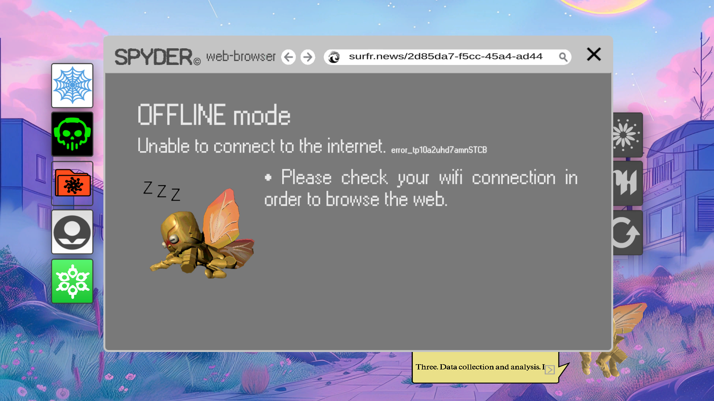

# Web Browser - Spyder

The web browser is called Spyder. It seems that a Wi-Fi password is needed before we can use it.

- Full error code: `error_tp10a2uhd7amnSTCB`
- Full default URL: `surfr.news/2d85da7-f5cc-45a4-ad44`

***

## Current findings

- Error code likely refers (partially) to [Top 10 Statues That Cried Blood](music/song-top10)
- When the first URL changed, it lead to the password for the [Dreadit file](files/dreadit) 
being unlocked.

***

## Previous findings

- Before the DREADIT file, you could type in the address bar. This did not lead to any clues.

***

## Read More

- [Webpage](webpage)